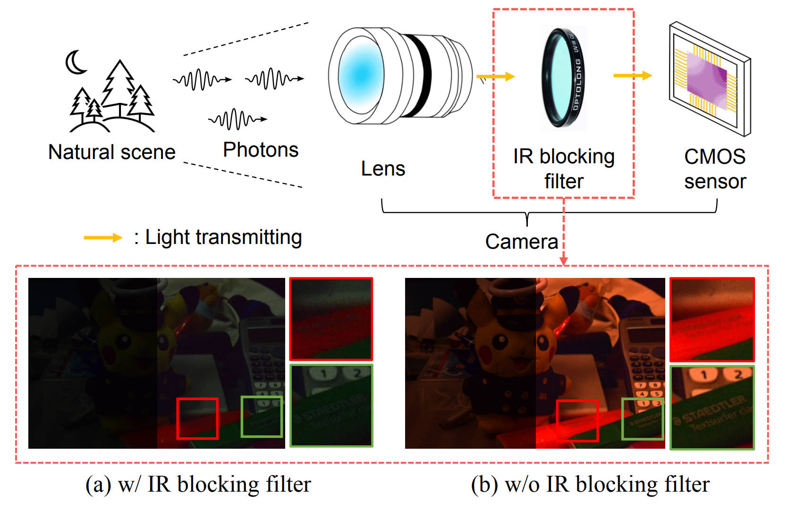

<br />

<p align="center">
  <h2 align="center"><strong>Enhancing Low-light Images Using Infrared Encoded Images</strong></h2>


  <p align="center">
      <a href="https://scholar.google.com/citations?user=8COQQ8QAAAAJ|hl=en|oi=sra" target='_blank'>Shulin Tian*</a>,&nbsp;
      <a href="https://scholar.google.com/citations?hl=en|user=jLd1l_sAAAAJ" target='_blank'>Yufei Wang*</a>,&nbsp;
      <a href="https://scholar.google.com/citations?user=S8_ES4MAAAAJ|hl=zh-CN" target='_blank'>Renjie Wan</a>,&nbsp;
      <a href="https://scholar.google.com/citations?user=S8nAnakAAAAJ|hl=zh-CN" target='_blank'>Wenhan Yang</a>,&nbsp;
      <a href="https://scholar.google.com/citations?user=UGZXLxIAAAAJ|hl=en" target='_blank'>Alex C. Kot</a>,&nbsp;
      <a href="https://scholar.google.com/citations?user=ypkClpwAAAAJ|hl=en" target='_blank'>Bihan Wen</a>,&nbsp;
    <br>
  Nanyang Technological University, Hong Kong Baptist University, Peng Cheng Laboratory
  </p>

  <p align="center">
    <a href="https://arxiv.org/pdf/2307.04122.pdf">Paper</a> | <a href="https://wyf0912.github.io/ELIEI/ ">Project Page</a>
  </p>
</p>

<p align="center">


The visibility of low-light images is enhanced by increasing the number of income photons (The right sides of (a) and (b) are amplified by a factor of 3.5 for better visualization).

</p>

<div id = "Dataset">
  <h2>Dataset</h2>
</div>


In this work, we are using a resized version - [IR-RGB-resize [Google Drive]](https://drive.google.com/drive/folders/1SOKXNn1uirRSDGOG5GnmllIXXgd1m1gT?usp=sharing) for our experiments. The file structure is constructed as follows:

```
data_root # The paths need to be specified in the training configs under folder `./code/confs/xx.yml`
└── train/
    ├── high/  
    └── low/
└── eval/
    ├── high/
    ├── low/
    └── low-rgb/
```

<br>

We also relased the original size of images for broadening research purposes [IR-RGB [Google Drive]](https://drive.google.com/drive/folders/1YXizC5-I7gpr4EkIxHhxbEdt_-SqLAQJ?usp=sharing), feel free to download and explore!


## Results

### Quantitative results
<!-- #### Evaluation on IR-RGB Dataset -->

The evauluation results on <a href="#Dataset"> IR-RGB dataset </a> are as follows:

| Method | PSNR | SSIM | LPIPS |
| :-- | :--: | :--: | :--: |
| RetinexNet | 11.14 | 0.628 | 0.586 |
| LIME | 11.31 | 0.639 | 0.560 |
|  Zero-DCE | 11.40 | 0.592 | 0.443 |
|  KinD | 14.73 |  0.714 | 0.357|
|  EnlightenGAN| 16.95 |  0.715 | 0.357|
|  KinD++ | 17.84 |  0.830 | 0.249|
|  MIRNet| 22.23 |  0.833 | 0.224|
|  LLFlow | 25.46 | 0.890 | 0.130 |
| **ELIEI (Ours)** | **26.23** | **0.899** | **0.116** |

The table shows quantitative comparison of existing SOTA methods and our method on the proposed dataset. We adapt PSNR, SSIM, and LPIPS to measure the reconstruction quality, structural similarity, and perceptual quality respectively.


### Qualitative results

#### Comparison with other methods

#### Usage of IR-RGB dataset

#### Usage of color alignment loss (CAL)


## Get Started
### Dependencies and Installation
- Python 3.8
- Pytorch 1.9

1. Clone Repo
```
git clone https://github.com/shulin16/ELIEI.git
```


2. Create Conda Environment
```
conda create --name ELIEI python=3.8
conda activate ELIEI
```

or you can just simply use `conda env create -f environment.yml` to install all the packages you need.

3. Install Dependencies
```
cd ELIEI
pip install -r requirements.txt
```


## Citation
If you find our work useful for your research, please cite our paper
```
@inproceedings{tian2023enhancing,
  title={Enhancing Low-Light Images Using Infrared Encoded Images},
  author={Tian, Shulin and Wang, Yufei and Wan, Renjie and Yang, Wenhan and Kot, Alex C and Wen, Bihan},
  booktitle={2023 IEEE International Conference on Image Processing (ICIP)},
  pages={465--469},
  year={2023},
  organization={IEEE}
}
```

### Acknowledgment
This work was done at Rapid-Rich Object Search (ROSE) Lab, Nanyang
Technological University. This research is supported in part by the NTU-PKU Joint Research Institute (a collaboration between the Nanyang Technological University and Peking University that is sponsored by a donation from the Ng Teng Fong Charitable Foundation), the Basic and Frontier Research Project of PCL, the Major Key Project of PCL, and the MOE AcRF
Tier 1 (RG61/22) and Start-Up Grant.
